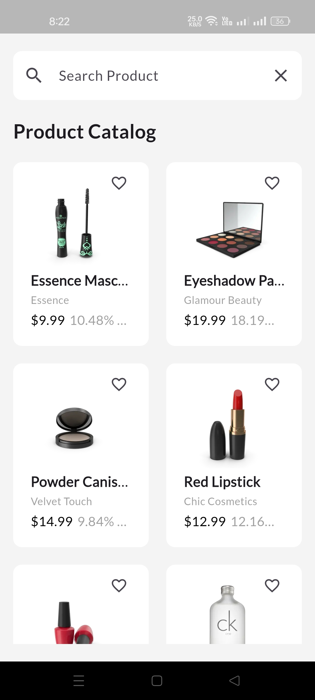
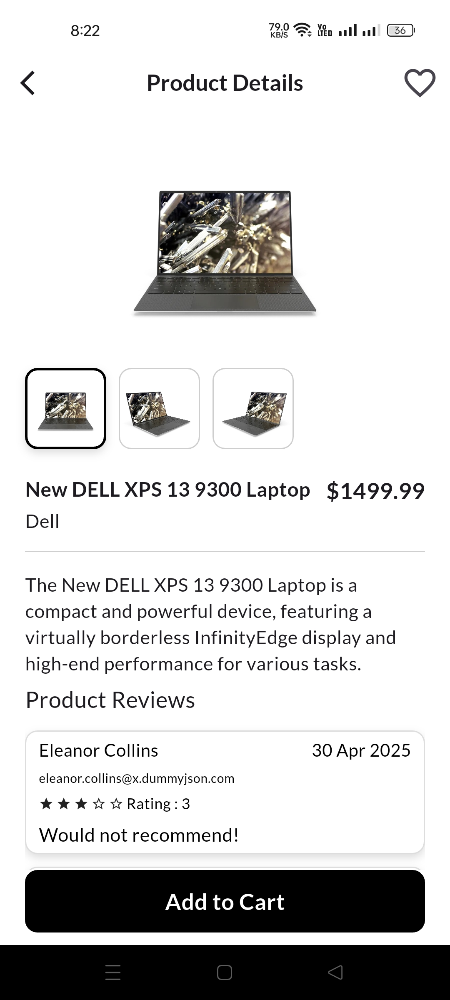
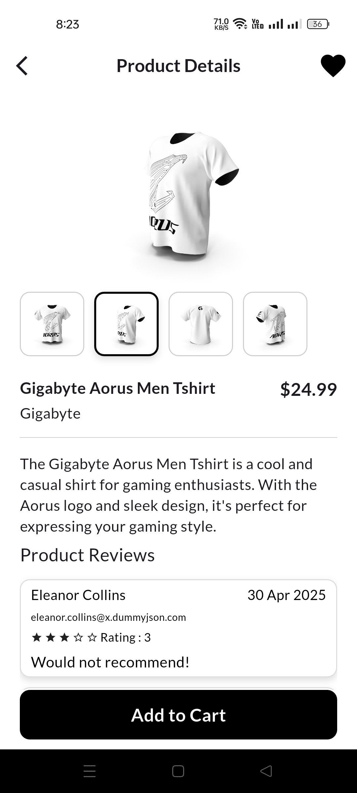
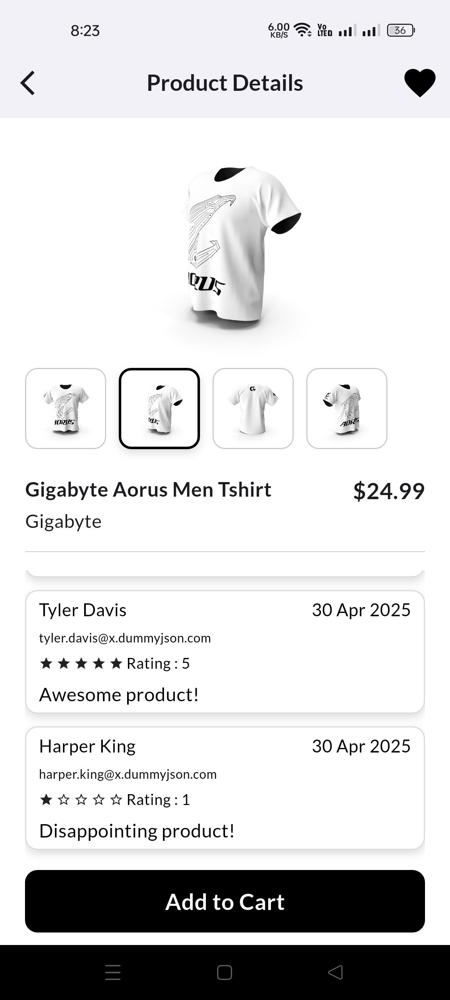
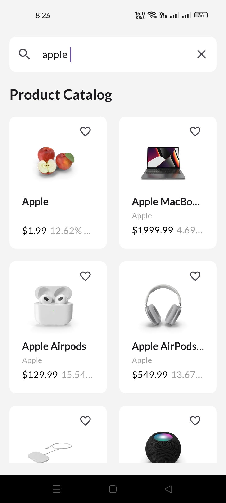

# 🛒 Product Listing App

A Flutter project that demonstrates a **Clean Architecture** implementation with **GetX** state management, **Dio** for API integration, and **unit testing** for business logic verification.

---

## 🧱 App Architecture Explanation

This app follows the **Flutter Clean Architecture** principles and separates concerns into three core layers:

### 1. **Data Layer**

- **Responsibilities**: API calls, data models, and data sources.
- **Key folders**:
  - `data_sources/`: Manages Dio-based API interactions.
  - `models/`: Handles request and response models.
  - `repository/`: Implements the `ProductRepository` interface to bridge the data source and domain.

### 2. **Domain Layer**

- **Responsibilities**: Business logic and rules.
- **Key folders**:
  - `entities/`: Pure Dart classes representing core business entities.
  - `repository/`: Abstract repository definitions.
  - `usecases/`: Application-specific use cases like fetching product lists,get product by id,save favorite product

### 3. **Presentation Layer**

- **Responsibilities**: UI, controllers, and user interaction logic.
- **Key folders**:
  - `controller/`: Uses **GetX** for state and logic management.
  - `pages/`: Contains the UI screens.
  - `widgets/`: Reusable UI components.

---

## 🧰 State Management

- Implemented using **GetX**, a lightweight and powerful Flutter package.
- Enables reactive UI updates and organized controller management.

---

## 🌐 Networking

- API integration is handled using **Dio**, providing robust error handling and request/response customization.
- Supports interceptors and connection error management.

---

## 🧪 Testing

- Includes **unit testing** for the Product List use case.
- Ensures reliability and correctness of domain logic and data interaction.

---

## 🚀 Getting Started

### Prerequisites

- Flutter SDK : 3.29.3
- Dart : 3.7.2
- VS Code or any Flutter IDE

## How to run the app.

- Download mention sdk
- flutter pub get
- flutter run

## 🖼️ Screenshots

### 📱 App Images

### 📱 App Demo Video

